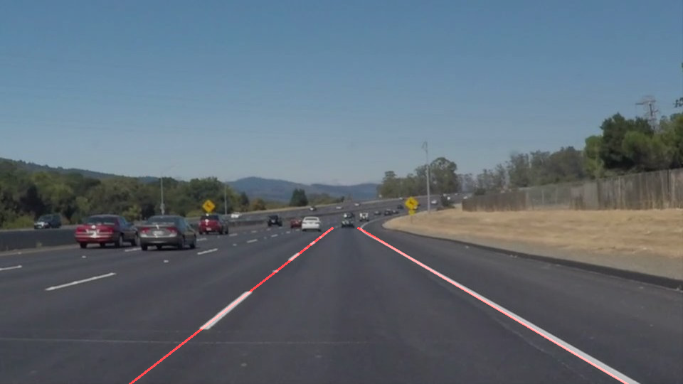
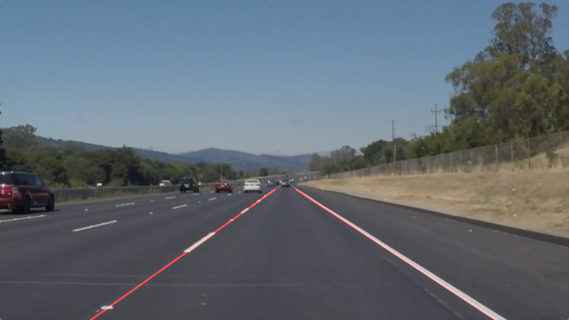
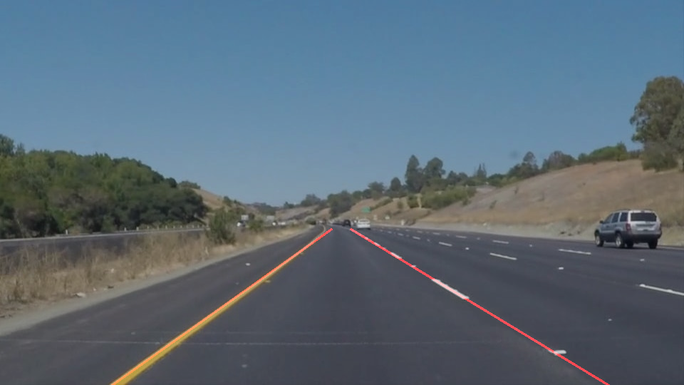
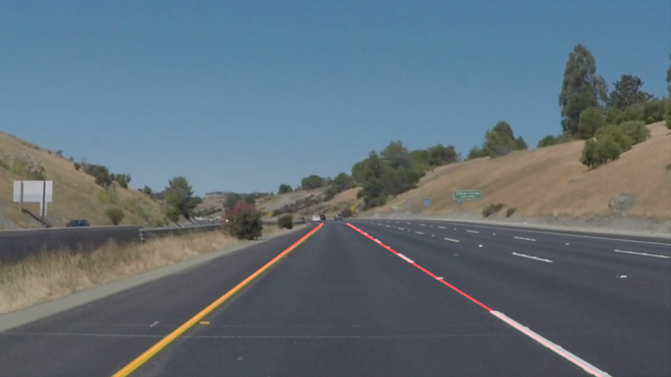
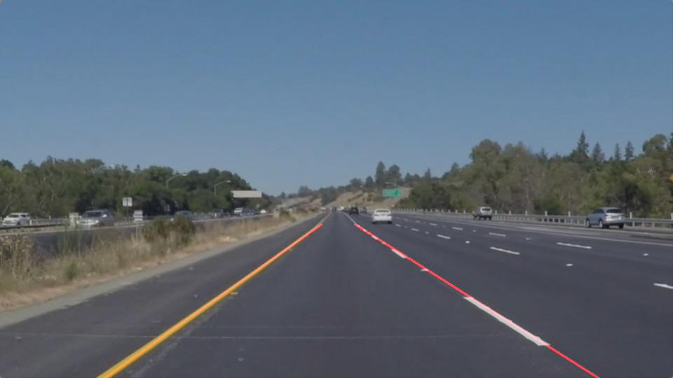
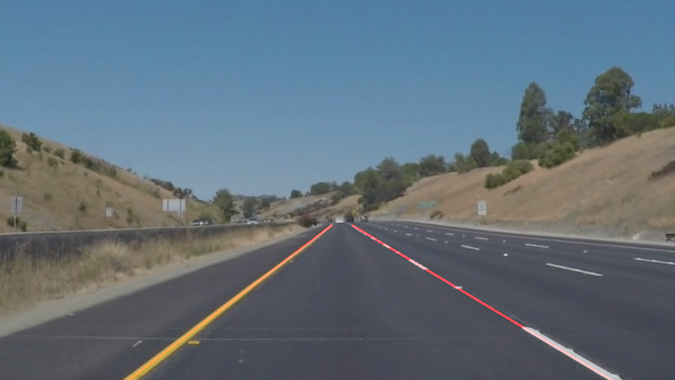

# **Finding Lane Lines on the Road** 

## Writeup Template

### You can use this file as a template for your writeup if you want to submit it as a markdown file. But feel free to use some other method and submit a pdf if you prefer.

---

**Finding Lane Lines on the Road**

The goals / steps of this project are the following:
* Make a pipeline that finds lane lines on the road
* Reflect on your work in a written report

[//]: # (Image References)

[image1]: ./examples/grayscale.jpg "Grayscale"

---

### Reflection

### 1. Describe your pipeline. As part of the description, explain how you modified the draw_lines() function.

My assumptions while building the pipelines are lanes will always converge to form a triangle and angle of view can be well defined and remains constant across lanes.

With this assumptions I created my with well defined 5 steps. 

1. Conversion to grayscale
2. Smoothing with Gaussian method
3. Edge detected using Canny Edge detection method
4. RoI
5. Hough transformation for line detection

At the end of the pipeline lines detected is combined with image for producing final output.

In order to draw a single line on the left and right lanes, I modified the draw_lines() to filter out lines based on slopes and by plotting one line across the slope. 

A consolidated view of all the stages applied on all the test images is attached for quick reference.

### 2. Identify potential shortcomings with your current pipeline

One potential shortcoming would be what would happen when road curve is of nature similar to the form of reverse or compound curve. Currently calculation uses fixed max length and min distance parameters which makes it works well for the sample present in the test folders   

I am not sure how this will behave to change in brightness (it could be different for excessive light, accumulation of water etc), merging lanes and headlights. 

### 3. Suggest possible improvements to your pipeline

My calculation around finding the triangle didn't work with challenge problem, left and right lane do cut through each other in farthest point. Also Edge detection may work just with this setup for now, and may require lot more optimization before it can be used.
